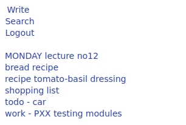

# zeronote
Ultra minimalist php flat-file notetaking app that is 1.1kB in a single file.  
This is a no-database note taking application, that is very simple.  

### Features
- write a note
- edit a note
- delete a note
- search notes
- get listing of notes
- protect notes with a password

With the first note you write, the "n/" directory will be created and every note will be there in form of a text file. This gives you the ability
to perform actions on your notes with whatever utilities you like.

### Install
1. copy `index.php` on your server/web hosting
2. change the password on line 18 (default is `xxx`)
